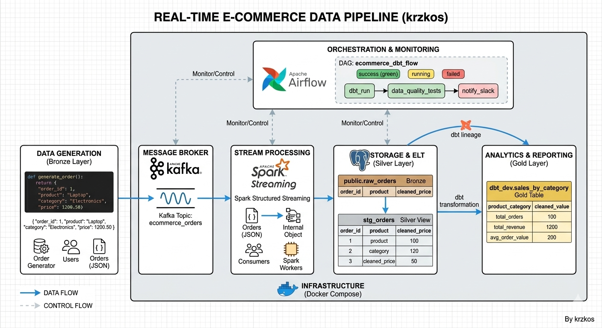

# 🚀 Real-Time E-commerce Data Pipeline

An end-to-end data engineering project simulating a high-traffic e-commerce platform. This pipeline streams raw order data, processes it in real-time, and delivers automated business intelligence reports.

## 🏗 System Architecture



The project follows a **Medallion Architecture** (Bronze -> Silver -> Gold) and is fully containerized using Docker.

### Tech Stack:
* **Data Generation:** Custom Python Producer (simulates real-time JSON order streams).
* **Message Broker:** Apache Kafka (ingestion layer).
* **Stream Processing:** Apache Spark Structured Streaming (ETL/Data Cleansing).
* **Storage:** PostgreSQL (serving as the Data Warehouse).
* **Transformation:** dbt (Data Build Tool) (modular SQL modeling).
* **Orchestration:** Apache Airflow (workflow automation).
* **Infrastructure:** Docker & Docker Compose.

---

## 📊 Data Flow Logic

1.  **Bronze (Ingestion):** Raw orders are pushed to Kafka and consumed by Spark, which writes them to the `public.raw_orders` table.
2.  **Silver (Staging):** dbt cleanses the data, handles timestamp parsing, and creates the `stg_orders` model.
3.  **Gold (Analytics):** Automated dbt models aggregate the data into `sales_by_category` to provide real-time business insights.

---

## 🚀 Getting Started

### 1. Prerequisite
Ensure you have Docker and Docker Compose installed.

### 2. Launch Infrastructure
```bash
docker-compose up -d
```

### 3. Run Real-Time Components
* **Open two separate terminals and run:**

* **Producer: python3 scripts/producer.py**

* **Spark Processor: spark-submit --packages org.apache.spark:spark-sql-kafka-0-10_2.12:3.5.0,org.postgresql:postgresql:42.7.2 scripts/spark_processor.py**

### 4. Access Airflow UI
* **URL: http://localhost:8080**

* **Credentials: admin / admin**

* **Action: Unpause the ecommerce_dbt_flow DAG to start the automated transformation cycle.**
